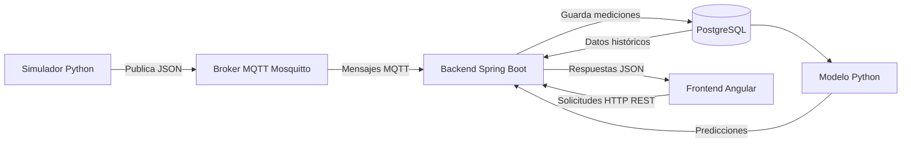

# Arquitectura del sistema de monitoreo solar

## 1. Descripción

La plataforma utiliza una arquitectura distribuida y desacoplada basada en
comunicación MQTT para la adquisición de datos y servicios REST para la
consulta de información desde el frontend.

Los principales componentes son:

- Simulador de datos en Python.
- Broker MQTT Eclipse Mosquitto.
- Backend en Java con Spring Boot.
- Base de datos PostgreSQL.
- Frontend web desarrollado con Angular.
- Futuro módulo de aprendizaje continuo desarrollado en Python.

## 2. Diagrama general


## 3. Responsabilidades de los componentes
### Simulador Python

Responsabilidades:

- Generar variables eléctricas y climáticas.
- Simular condiciones normales y anómalas.
- Construir mensajes en formato JSON.
- Publicar datos periódicamente en MQTT.
- Permitir configurar la frecuencia de publicación.
- Incluir una marca de tiempo en cada medición.

### Broker MQTT

Responsabilidades:

- Recibir los mensajes publicados por el simulador o los sensores.
- Distribuir los mensajes entre los componentes suscritos.
- Desacoplar la adquisición de datos del backend.
- Manejar tópicos asociados a dispositivos y variables.

Tecnología seleccionada:

Eclipse Mosquitto.

### Backend Spring Boot

Responsabilidades:

- Suscribirse a los tópicos MQTT.
- Recibir los mensajes de telemetría.
- Deserializar los mensajes JSON.
- Validar campos, tipos de datos y rangos.
- Almacenar mediciones en PostgreSQL.
- Exponer una API REST.
- Gestionar autenticación y autorización.
- Proporcionar información al frontend.
- Registrar errores y eventos importantes.

### PostgreSQL

Responsabilidades:

- Almacenar usuarios.
- Almacenar dispositivos.
- Almacenar mediciones eléctricas.
- Almacenar mediciones climáticas.
- Almacenar eventos y alertas.
- Facilitar consultas históricas.

### Frontend Angular

Responsabilidades:

- Presentar la interfaz de autenticación.
- Mostrar indicadores con las últimas mediciones.
- Mostrar gráficas históricas.
- Permitir filtrar por variable y fecha.
- Informar sobre errores de comunicación.
- Consumir la API REST del backend.

### Modelo de aprendizaje continuo

Este componente será implementado en una etapa posterior.

Responsabilidades previstas:

- Consultar datos históricos.
- Preprocesar las mediciones.
- Entrenar o actualizar modelos.
- Generar predicciones.
- Detectar desviaciones o comportamientos anómalos.
- Enviar resultados al backend.

## 4. Flujo de datos
1. Python genera una medición.
2. Python convierte la medición a JSON.
3. El mensaje se publica en un tópico MQTT.
4. Mosquitto entrega el mensaje al backend.
5. Spring Boot deserializa y valida el mensaje.
6. Los datos válidos se almacenan en PostgreSQL.
7. Angular solicita datos mediante la API REST.
8. Spring Boot consulta PostgreSQL.
9. El backend retorna una respuesta JSON.
10. Angular presenta la información en indicadores y gráficas.

## 5. Protocolo de comunicación
### Entre Python y Spring Boot
- Protocolo: MQTT.
- Formato: JSON.
- Broker inicial: Eclipse Mosquitto.
- Puerto local: 1883.
- Calidad de servicio inicial: QoS 1.

### Entre Angular y Spring Boot
- Protocolo: HTTP o HTTPS.
- Estilo: API REST.
- Formato: JSON.

### Entre Spring Boot y PostgreSQL
- Driver JDBC.
- Spring Data JPA.
- Hibernate como implementación ORM.

## 6. Tópicos MQTT iniciales

Se propone la siguiente estructura:
```text
solar/{deviceId}/telemetry
solar/{deviceId}/status
solar/{deviceId}/alerts
```
Ejemplos:
```text
solar/panel-001/telemetry
solar/panel-001/status
solar/panel-001/alerts
```
## 7. Formato inicial del mensaje

```json
{
  "deviceId": "panel-001",
  "timestamp": "2026-06-06T20:30:00Z",
  "voltage": 32.5,
  "current": 7.8,
  "power": 253.5,
  "irradiance": 780.0,
  "ambientTemperature": 19.2,
  "panelTemperature": 35.4,
  "relativeHumidity": 67.0
}
```

## 8. Principios arquitectónicos
- Separación de responsabilidades.
- Bajo acoplamiento entre componentes.
- Comunicación mediante formatos estandarizados.
- Validación de datos antes de almacenarlos.
- Trazabilidad mediante registros de eventos.
- Capacidad de sustituir el simulador por sensores reales.
- Posibilidad de incorporar nuevos dispositivos.
- Preparación para integrar modelos predictivos.