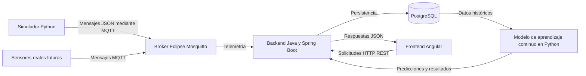

# ADR-001: Arquitectura general de la plataforma

## Contexto

El proyecto tiene como objetivo desarrollar una plataforma web para el monitoreo de un sistema solar fotovoltaico instalado en la Fundación Universitaria Los Libertadores.

La plataforma deberá recibir variables eléctricas y climáticas, almacenarlas, procesarlas y presentarlas mediante una interfaz web. En una fase posterior, también deberá integrar un modelo de aprendizaje continuo que permita realizar predicciones y detectar cambios en el comportamiento del sistema.

Durante las primeras etapas del proyecto no se contará permanentemente con los sensores físicos, por lo que será necesario generar datos simulados que permitan validar el funcionamiento de la arquitectura, la comunicación entre componentes, la persistencia de información y la visualización.

El sistema debe permitir reemplazar posteriormente el simulador por dispositivos y sensores reales sin requerir cambios significativos en los demás componentes.

También se requiere que la solución tenga las siguientes características:

* Separación clara de responsabilidades.
* Bajo acoplamiento entre componentes.
* Facilidad de mantenimiento.
* Posibilidad de incorporar nuevos sensores o dispositivos.
* Capacidad de procesar datos en tiempo casi real.
* Persistencia de información histórica.
* Posibilidad de integrar modelos desarrollados en Python.
* Ejecución local durante el desarrollo.
* Capacidad de desplegarse posteriormente en infraestructura remota o en la nube.

## Opciones consideradas

### Opción 1: Aplicación monolítica con un único lenguaje

Esta opción consiste en implementar la adquisición de datos, el procesamiento, la persistencia y la interfaz de usuario dentro de una única aplicación.

#### Ventajas

* Menor cantidad de componentes.
* Configuración inicial más sencilla.
* Despliegue inicial más rápido.
* Menor complejidad para pruebas locales básicas.

#### Desventajas

* Mayor acoplamiento entre funcionalidades.
* Menor flexibilidad para integrar dispositivos IoT.
* Dificultad para integrar modelos de aprendizaje automático desarrollados en Python.
* Menor facilidad para sustituir o escalar componentes individualmente.
* La adquisición de datos quedaría vinculada directamente con la lógica de la aplicación.

### Opción 2: Arquitectura completamente basada en microservicios

Esta opción consiste en separar cada funcionalidad en un servicio independiente, por ejemplo:

* Servicio de autenticación.
* Servicio de adquisición de datos.
* Servicio de almacenamiento.
* Servicio de alertas.
* Servicio de predicción.
* Servicio de administración de dispositivos.

#### Ventajas

* Alta independencia entre servicios.
* Escalabilidad individual.
* Facilidad para utilizar diferentes tecnologías.
* Mayor aislamiento de fallos.

#### Desventajas

* Mayor complejidad de desarrollo y despliegue.
* Necesidad de implementar mecanismos adicionales de comunicación y observabilidad.
* Mayor esfuerzo de configuración.
* Complejidad innecesaria para el alcance inicial de la tesis.
* Mayor dificultad para mantener el proyecto con un equipo pequeño.

### Opción 3: Arquitectura modular y desacoplada por componentes

Esta opción separa el sistema en componentes principales con responsabilidades definidas:

* Simulador y futuro módulo de aprendizaje continuo en Python.
* Broker MQTT para intercambio de telemetría.
* Backend modular en Java con Spring Boot.
* Base de datos PostgreSQL.
* Frontend web en Angular.

El backend se implementará inicialmente como una aplicación modular y no como un conjunto de microservicios independientes.

## Decisión

Se adopta una arquitectura modular y distribuida por componentes, compuesta por:

1. Un simulador de datos desarrollado en Python.
2. Un broker MQTT implementado con Eclipse Mosquitto.
3. Un backend desarrollado con Java y Spring Boot.
4. Una base de datos PostgreSQL.
5. Un frontend web desarrollado con Angular.
6. Un futuro módulo de aprendizaje continuo desarrollado en Python.

La comunicación para la adquisición de telemetría se realizará mediante MQTT, mientras que la comunicación entre el frontend y el backend se realizará mediante una API REST sobre HTTP o HTTPS.

El backend será inicialmente una aplicación modular. No se dividirá en microservicios durante el MVP, aunque su estructura interna deberá facilitar una separación futura si el crecimiento del sistema lo requiere.

## Arquitectura seleccionada



## Responsabilidades de los componentes

### Simulador Python

El simulador será responsable de:

* Generar variables eléctricas y climáticas.
* Simular condiciones normales de operación.
* Simular datos fuera de rango o situaciones anómalas.
* Generar mensajes en formato JSON.
* Publicar mediciones mediante MQTT.
* Permitir configurar el intervalo de publicación.
* Facilitar las pruebas sin depender de los sensores físicos.

### Broker MQTT

Eclipse Mosquitto será responsable de:

* Recibir mensajes publicados por el simulador o los sensores.
* Distribuir los mensajes entre los consumidores suscritos.
* Desacoplar la fuente de datos del backend.
* Administrar los tópicos de telemetría, estado y alertas.
* Permitir la incorporación futura de múltiples dispositivos.

### Backend Spring Boot

El backend será responsable de:

* Suscribirse a los tópicos MQTT.
* Recibir los mensajes de telemetría.
* Deserializar los mensajes JSON.
* Validar los campos y rangos de los datos.
* Manejar mensajes inválidos sin detener el servicio.
* Persistir las mediciones en PostgreSQL.
* Exponer una API REST.
* Gestionar autenticación y autorización.
* Consultar datos históricos.
* Proporcionar información al frontend.
* Registrar errores, advertencias y eventos relevantes.
* Integrar posteriormente los resultados del modelo de aprendizaje continuo.

### PostgreSQL

La base de datos será responsable de:

* Almacenar usuarios.
* Almacenar dispositivos.
* Almacenar mediciones eléctricas.
* Almacenar mediciones climáticas.
* Almacenar alertas y eventos.
* Almacenar predicciones futuras.
* Mantener la integridad y relación entre los datos.
* Facilitar consultas históricas y agregaciones.

### Frontend Angular

El frontend será responsable de:

* Presentar la interfaz de autenticación.
* Mostrar las últimas mediciones disponibles.
* Mostrar indicadores eléctricos y climáticos.
* Mostrar gráficas históricas.
* Permitir filtros por dispositivo, variable y rango de fechas.
* Presentar alertas y estados del sistema.
* Consumir la API REST del backend.
* Manejar errores de comunicación de manera comprensible para el usuario.

### Modelo de aprendizaje continuo

El modelo será desarrollado en Python en una etapa posterior y será responsable de:

* Consultar o recibir datos históricos.
* Limpiar y transformar las mediciones.
* Entrenar un modelo inicial.
* Actualizar el modelo cuando se incorporen nuevas mediciones.
* Generar predicciones de variables climáticas o energéticas.
* Detectar desviaciones en el comportamiento del sistema.
* Proporcionar los resultados al backend.

## Flujo principal de información

1. El simulador genera una medición.
2. La medición se estructura como un mensaje JSON.
3. El simulador publica el mensaje en un tópico MQTT.
4. Eclipse Mosquitto recibe el mensaje.
5. El backend obtiene el mensaje mediante una suscripción MQTT.
6. El backend deserializa el contenido.
7. El backend valida los campos requeridos y sus valores.
8. Las mediciones válidas se almacenan en PostgreSQL.
9. Los mensajes inválidos se registran en los logs.
10. El frontend solicita información mediante la API REST.
11. El backend consulta los datos en PostgreSQL.
12. El backend responde al frontend en formato JSON.
13. Angular presenta los datos mediante indicadores, tablas y gráficas.

## Estructura interna inicial del backend

El backend deberá organizarse por responsabilidades:

```text
backend/src/main/java/com/edwincala/solar/
├── config/
├── controller/
├── dto/
├── entity/
├── exception/
├── mapper/
├── mqtt/
├── repository/
├── security/
└── service/
```

La estructura podrá evolucionar a una organización por funcionalidades si el proyecto crece significativamente.

## Estructura inicial del simulador

```text
simulador/
├── src/
│   ├── config.py
│   ├── generator.py
│   ├── mqtt_client.py
│   ├── schemas.py
│   └── main.py
├── tests/
├── requirements.txt
├── .env.example
└── README.md
```

## Estructura inicial del frontend

```text
frontend/src/app/
├── core/
├── shared/
├── features/
│   ├── auth/
│   ├── dashboard/
│   ├── devices/
│   └── measurements/
└── app.routes.ts
```

## Consecuencias positivas

* El sistema queda dividido en componentes con responsabilidades claras.
* El simulador podrá ser reemplazado por sensores reales.
* MQTT desacopla la adquisición de datos del procesamiento.
* Python podrá utilizarse de forma independiente para simulación y aprendizaje automático.
* Spring Boot centralizará la lógica de negocio y el acceso a los datos.
* Angular permanecerá separado de la lógica de adquisición y persistencia.
* PostgreSQL permitirá almacenar y consultar información histórica.
* Cada componente podrá probarse de manera independiente.
* La arquitectura podrá ejecutarse localmente con Docker Compose.
* La solución podrá ampliarse posteriormente sin rediseñar completamente el sistema.

## Consecuencias negativas

* Será necesario configurar y mantener varios componentes.
* Se deberá trabajar con diferentes lenguajes y tecnologías.
* La comunicación entre componentes puede generar errores de integración.
* Será necesario definir contratos de datos claros.
* Se requerirá gestionar variables de entorno y configuraciones diferentes.
* El despliegue será más complejo que el de una aplicación monolítica.
* Se deberán implementar mecanismos de registro y seguimiento de errores distribuidos.

## Riesgos

* Incompatibilidad entre el formato publicado por Python y el esperado por Spring Boot.
* Pérdida de mensajes por desconexiones del broker o del consumidor.
* Registros duplicados por reenvío de mensajes MQTT.
* Crecimiento acelerado del volumen de mediciones.
* Diferencias horarias si los componentes no utilizan una zona temporal común.
* Exposición de credenciales dentro del repositorio.
* Dependencia excesiva de configuraciones locales.

## Medidas de mitigación

* Definir un contrato JSON versionado.
* Validar todos los mensajes antes de almacenarlos.
* Utilizar UTC para las marcas de tiempo.
* Implementar identificadores únicos de mensajes cuando sea necesario.
* Configurar políticas de reconexión.
* Utilizar variables de entorno para credenciales.
* Mantener un archivo `.env.example` sin información sensible.
* Incorporar migraciones versionadas para PostgreSQL.
* Registrar errores de integración en los logs.
* Crear pruebas de integración entre Python, MQTT, Spring Boot y PostgreSQL.

## Criterios para revisar esta decisión

Esta decisión deberá revisarse si ocurre alguna de las siguientes condiciones:

* El backend crece hasta dificultar su mantenimiento como aplicación modular.
* Se requiere escalar de forma independiente la adquisición, predicción o consulta.
* Se incorporan múltiples plantas solares.
* El volumen de mensajes supera la capacidad de la arquitectura inicial.
* Se requiere alta disponibilidad.
* El modelo de aprendizaje necesita una integración diferente.
* Se incorporan requisitos de procesamiento en tiempo real más exigentes.

## Resultado esperado

La arquitectura seleccionada deberá permitir demostrar el siguiente flujo mínimo durante el MVP:

```text
Simulador Python
        ↓
Eclipse Mosquitto
        ↓
Backend Spring Boot
        ↓
PostgreSQL
        ↓
API REST
        ↓
Frontend Angular
```

La arquitectura también deberá permitir sustituir el simulador por sensores reales sin modificar sustancialmente el backend, la base de datos ni el frontend.
