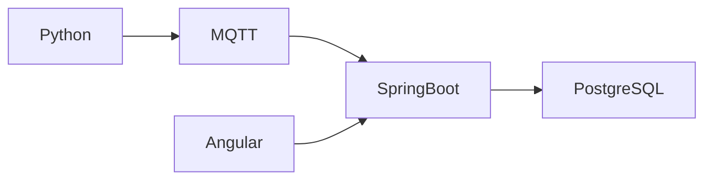

# Estándares de desarrollo

## 1. Objetivo

Este documento define los estándares técnicos, de calidad y organización que deben seguirse durante el desarrollo de la plataforma de monitoreo solar.

Su propósito es:

* Mantener consistencia entre componentes.
* Facilitar la lectura y mantenimiento del código.
* Reducir errores.
* Mejorar la trazabilidad.
* Facilitar las pruebas.
* Evitar acoplamiento innecesario.
* Mantener la documentación actualizada.
* Preparar el sistema para futuras ampliaciones.

Estos estándares aplican a:

* Backend con Java y Spring Boot.
* Simulador con Python.
* Futuro modelo de aprendizaje continuo con Python.
* Frontend con Angular y TypeScript.
* Base de datos PostgreSQL.
* Integración mediante MQTT.
* Infraestructura con Docker Compose.
* Documentación del proyecto.

## 2. Principios generales

Todo desarrollo deberá seguir los siguientes principios.

### 2.1 Claridad

El código debe priorizar la comprensión sobre soluciones excesivamente compactas.

Los nombres deben expresar la intención del elemento.

Ejemplo recomendado:

```java
calculateGeneratedPower()
```

Ejemplo no recomendado:

```java
calc()
```

### 2.2 Responsabilidad única

Cada clase, función, componente o módulo debe tener una responsabilidad principal.

No se debe concentrar en una misma clase:

* Acceso a datos.
* Validación.
* Lógica de negocio.
* Conversión de objetos.
* Comunicación externa.

### 2.3 Bajo acoplamiento

Los componentes deben depender de contratos y abstracciones claras.

El simulador no debe depender de la implementación interna del backend.

Angular no debe acceder directamente a PostgreSQL ni a MQTT durante el MVP.

### 2.4 Alta cohesión

Los elementos relacionados deben permanecer agrupados.

La lógica MQTT debe ubicarse en módulos específicos y no distribuirse sin criterio entre controladores, entidades o componentes visuales.

### 2.5 Simplicidad

Se debe implementar la solución más sencilla que cumpla los requisitos actuales.

No se introducirán microservicios, patrones o dependencias sin una necesidad demostrada.

### 2.6 Reutilización controlada

Debe evitarse la duplicación, pero no se crearán abstracciones prematuras.

Una abstracción debe incorporarse cuando:

* Exista lógica repetida.
* Exista un concepto de dominio claro.
* Facilite pruebas o mantenimiento.
* Reduzca acoplamiento real.

### 2.7 Trazabilidad

Los cambios deben estar asociados con:

* Historias de usuario.
* Issues.
* Pull Requests.
* Commits descriptivos.
* Pruebas.
* Documentación.

## 3. Idioma del proyecto

Se utilizará:

* Inglés para nombres de clases, métodos, variables, funciones y campos técnicos.
* Inglés para mensajes de commit.
* Inglés para nombres de ramas.
* Español para documentación académica y funcional.
* Inglés o español para comentarios, manteniendo consistencia dentro de cada módulo.

Ejemplo:

```java
public Measurement saveMeasurement(TelemetryMessage message)
```

No recomendado:

```java
public Medicion guardarMeasurement(Mensaje message)
```

Los nombres de campos JSON serán definidos en inglés.

## 4. Estándares de Java y Spring Boot

## 4.1 Versión

Se utilizará una versión LTS de Java definida de manera uniforme en:

* `pom.xml`.
* Maven Wrapper.
* Dockerfile futuro.
* Documentación del backend.
* Integración continua.

Se recomienda Java 21, salvo que una dependencia o restricción del entorno exija otra versión.

## 4.2 Convenciones de nombres

| Elemento      | Convención       | Ejemplo                       |
| ------------- | ---------------- | ----------------------------- |
| Clases        | PascalCase       | `MeasurementService`          |
| Interfaces    | PascalCase       | `MeasurementRepository`       |
| Métodos       | camelCase        | `findLatestMeasurement`       |
| Variables     | camelCase        | `deviceCode`                  |
| Constantes    | UPPER_SNAKE_CASE | `MAX_HUMIDITY`                |
| Paquetes      | minúsculas       | `com.edwincala.solar.service` |
| Enumeraciones | PascalCase       | `DataQuality`                 |
| Valores enum  | UPPER_SNAKE_CASE | `INVALID_TIMESTAMP`           |

## 4.3 Organización del backend

Estructura inicial recomendada:

```text
backend/src/main/java/com/edwincala/solar/
├── config/
├── controller/
├── dto/
│   ├── request/
│   └── response/
├── entity/
├── exception/
├── mapper/
├── mqtt/
├── repository/
├── security/
├── service/
└── validation/
```

Responsabilidades:

### `config`

Configuraciones de Spring, MQTT, seguridad, serialización y otras integraciones.

### `controller`

Controladores REST.

Deben:

* Recibir solicitudes.
* Delegar en servicios.
* Retornar respuestas HTTP.
* Validar DTO de entrada.

No deben:

* Contener reglas de negocio.
* Ejecutar consultas directamente.
* Construir manualmente lógica compleja.
* Consumir MQTT.

### `dto`

Objetos de transferencia de datos.

Se utilizarán para:

* Solicitudes REST.
* Respuestas REST.
* Mensajes MQTT.
* Comunicación con servicios externos.

Las entidades JPA no deben exponerse directamente desde los controladores.

### `entity`

Entidades persistentes de JPA.

Deben representar el modelo de base de datos y no el contrato público de la API.

### `exception`

Excepciones personalizadas y manejo global de errores.

### `mapper`

Conversiones entre:

* DTO.
* Entidad.
* Modelo de dominio.
* Mensaje MQTT.

### `mqtt`

Publicadores, consumidores, configuración y tratamiento específico de MQTT.

### `repository`

Interfaces de acceso a PostgreSQL.

### `service`

Lógica de negocio y coordinación entre componentes.

### `validation`

Validaciones reutilizables del dominio.

## 4.4 Inyección de dependencias

Se utilizará inyección por constructor.

Recomendado:

```java
@Service
public class MeasurementService {

    private final MeasurementRepository measurementRepository;

    public MeasurementService(
            MeasurementRepository measurementRepository
    ) {
        this.measurementRepository = measurementRepository;
    }
}
```

No recomendado:

```java
@Autowired
private MeasurementRepository measurementRepository;
```

La inyección por constructor:

* Facilita pruebas.
* Hace explícitas las dependencias.
* Permite campos inmutables.
* Evita objetos parcialmente configurados.

## 4.5 Controladores REST

Los controladores deben ser pequeños.

Ejemplo:

```java
@RestController
@RequestMapping("/api/v1/measurements")
public class MeasurementController {

    private final MeasurementService measurementService;

    public MeasurementController(
            MeasurementService measurementService
    ) {
        this.measurementService = measurementService;
    }

    @GetMapping("/latest")
    public ResponseEntity<MeasurementResponse> findLatest(
            @RequestParam String deviceCode
    ) {
        MeasurementResponse response =
                measurementService.findLatest(deviceCode);

        return ResponseEntity.ok(response);
    }
}
```

No se deben incluir consultas o cálculos extensos dentro del controlador.

## 4.6 Servicios

Los servicios deben:

* Implementar reglas de negocio.
* Coordinar repositorios.
* Aplicar validaciones.
* Gestionar transacciones.
* Lanzar excepciones específicas.
* Facilitar pruebas unitarias.

Las clases de servicio deben evitar convertirse en clases excesivamente grandes.

Cuando un servicio tenga múltiples responsabilidades deberá dividirse.

## 4.7 Repositorios

Los repositorios deben limitarse al acceso a datos.

Ejemplo:

```java
public interface MeasurementRepository
        extends JpaRepository<MeasurementEntity, UUID> {

    Optional<MeasurementEntity>
    findFirstByDeviceIdOrderByMeasuredAtDesc(UUID deviceId);
}
```

Las consultas complejas deberán:

* Tener nombres claros.
* Documentarse cuando no sean evidentes.
* Probarse mediante pruebas de integración.
* Evitar problemas de consultas repetitivas.

## 4.8 Entidades JPA

Las entidades deberán:

* Definir restricciones coherentes.
* Mantener relaciones necesarias.
* Evitar relaciones bidireccionales sin justificación.
* Evitar carga ansiosa por defecto.
* No contener lógica de presentación.
* No utilizarse directamente como respuesta REST.

Se recomienda utilizar:

```java
FetchType.LAZY
```

para relaciones cuando sea apropiado.

Se debe tener precaución con:

* `equals`.
* `hashCode`.
* `toString`.
* Relaciones circulares.
* Serialización de asociaciones.

## 4.9 DTO y validación

Los DTO de entrada deberán validarse con Jakarta Validation.

Ejemplo:

```java
public record TelemetryRequest(
        @NotBlank String deviceId,
        @NotNull Instant timestamp,
        @PositiveOrZero Double voltage,
        @PositiveOrZero Double current,
        @PositiveOrZero Double power,
        @PositiveOrZero Double irradiance,
        @DecimalMin("0.0")
        @DecimalMax("100.0")
        Double relativeHumidity
) {
}
```

La validación sintáctica no reemplaza la validación del dominio.

Ejemplo:

* Jakarta Validation verifica que la humedad esté entre 0 y 100.
* El servicio podrá verificar si el valor es coherente con el sensor o el estado de operación.

## 4.10 Uso de `record`

Se podrán utilizar `record` para DTO inmutables cuando sean compatibles con la versión de Java.

Ejemplo:

```java
public record MeasurementResponse(
        UUID id,
        String deviceCode,
        Instant measuredAt,
        Double power
) {
}
```

No se utilizarán `record` como entidades JPA.

## 4.11 Manejo de excepciones

Se implementará un manejador global mediante:

```java
@RestControllerAdvice
```

Las excepciones deberán representar errores específicos.

Ejemplos:

```text
DeviceNotFoundException
DuplicateMessageException
InvalidTelemetryException
UnsupportedSchemaVersionException
```

No se deben exponer al cliente:

* Trazas completas.
* Consultas SQL.
* Nombres de tablas internas.
* Credenciales.
* Rutas locales.
* Detalles sensibles.

Ejemplo de respuesta:

```json
{
  "timestamp": "2026-06-07T14:30:00Z",
  "status": 400,
  "error": "Invalid telemetry",
  "message": "Relative humidity must be between 0 and 100",
  "path": "/api/v1/measurements"
}
```

## 4.12 Transacciones

Las transacciones deben definirse en la capa de servicio.

Ejemplo:

```java
@Transactional
public MeasurementResponse saveTelemetry(
        TelemetryMessage message
) {
    // Validación y persistencia
}
```

Para operaciones de consulta:

```java
@Transactional(readOnly = true)
```

No se deben crear transacciones innecesariamente extensas.

## 4.13 Registros de aplicación

Se utilizará una biblioteca de logging compatible con Spring Boot.

Ejemplo:

```java
private static final Logger LOGGER =
        LoggerFactory.getLogger(MeasurementService.class);
```

Niveles:

| Nivel   | Uso                                  |
| ------- | ------------------------------------ |
| `TRACE` | Diagnóstico extremadamente detallado |
| `DEBUG` | Información de desarrollo            |
| `INFO`  | Eventos normales importantes         |
| `WARN`  | Situaciones inesperadas recuperables |
| `ERROR` | Fallos que requieren atención        |

Ejemplos:

```java
LOGGER.info(
    "Telemetry stored for device {} at {}",
    deviceCode,
    measuredAt
);
```

```java
LOGGER.warn(
    "Duplicate MQTT message ignored: {}",
    messageId
);
```

No se deben registrar:

* Contraseñas.
* Tokens.
* Claves.
* Cadenas completas de conexión.
* Datos personales sensibles.
* Mensajes completos si contienen información confidencial.

## 4.14 Uso de comentarios

Los comentarios deben explicar el motivo y no repetir el código.

No recomendado:

```java
// Incrementar contador
counter++;
```

Recomendado:

```java
// QoS 1 may deliver duplicate messages, so the identifier
// is verified before persistence.
```

Se debe eliminar código comentado que ya no se utilice.

## 4.15 Formato del código Java

Se deberá mantener:

* Sangría de cuatro espacios.
* Una clase pública por archivo.
* Llaves consistentes.
* Longitud de línea razonable.
* Importaciones organizadas.
* Ausencia de importaciones no utilizadas.
* Final de línea uniforme.

Se podrá incorporar una herramienta como:

* Spotless.
* Checkstyle.
* SonarQube o SonarCloud.

La herramienta seleccionada deberá configurarse para ejecutarse de forma reproducible.

## 5. Estándares de Python

## 5.1 Versión

Se utilizará Python 3 en una versión definida en:

* README del simulador.
* Archivo de configuración.
* Entorno virtual.
* Dockerfile futuro.
* Integración continua.

## 5.2 Convenciones

Se seguirá PEP 8.

| Elemento   | Convención       | Ejemplo              |
| ---------- | ---------------- | -------------------- |
| Funciones  | snake_case       | `generate_telemetry` |
| Variables  | snake_case       | `panel_temperature`  |
| Clases     | PascalCase       | `TelemetryGenerator` |
| Constantes | UPPER_SNAKE_CASE | `DEFAULT_INTERVAL`   |
| Módulos    | snake_case       | `mqtt_client.py`     |
| Paquetes   | snake_case       | `data_generation`    |

## 5.3 Estructura del simulador

```text
simulador/
├── src/
│   ├── __init__.py
│   ├── config.py
│   ├── generator.py
│   ├── mqtt_client.py
│   ├── schemas.py
│   └── main.py
├── tests/
│   ├── test_generator.py
│   ├── test_mqtt_client.py
│   └── test_schemas.py
├── requirements.txt
├── .env.example
└── README.md
```

Responsabilidades:

### `config.py`

Lectura y validación de variables de entorno.

### `generator.py`

Generación de variables eléctricas y climáticas.

### `mqtt_client.py`

Conexión, publicación y reconexión MQTT.

### `schemas.py`

Estructuras de mensajes y validación.

### `main.py`

Punto de entrada y coordinación general.

## 5.4 Anotaciones de tipo

Las funciones deberán utilizar anotaciones de tipo cuando sea razonable.

Ejemplo:

```python
def calculate_power(
    voltage: float,
    current: float,
) -> float:
    return voltage * current
```

Se evitará:

```python
def calculate_power(v, i):
    return v * i
```

## 5.5 Funciones

Las funciones deben:

* Tener una responsabilidad.
* Recibir dependencias explícitas.
* Evitar efectos secundarios innecesarios.
* Retornar valores claros.
* Tener nombres descriptivos.
* Ser pequeñas y comprobables.

Ejemplo:

```python
def validate_relative_humidity(value: float) -> None:
    if not 0.0 <= value <= 100.0:
        raise ValueError(
            "Relative humidity must be between 0 and 100."
        )
```

## 5.6 Docstrings

Las funciones públicas, clases y módulos relevantes deberán tener docstrings.

Ejemplo:

```python
def generate_irradiance(
    hour: float,
    maximum: float,
) -> float:
    """
    Generate simulated solar irradiance for a given hour.

    Args:
        hour: Decimal hour of the day.
        maximum: Maximum expected irradiance in W/m².

    Returns:
        Simulated irradiance in W/m².
    """
```

No es necesario agregar docstrings que repitan información evidente.

## 5.7 Manejo de errores

No se deben capturar excepciones genéricas sin tratamiento.

No recomendado:

```python
try:
    publish_message()
except Exception:
    pass
```

Recomendado:

```python
try:
    publish_message()
except MqttConnectionError as error:
    logger.error(
        "Unable to publish telemetry: %s",
        error,
    )
    raise
```

Cuando se capture una excepción debe:

* Registrarse información útil.
* Recuperarse de forma explícita.
* Volver a lanzarse cuando el llamador deba conocer el fallo.
* Evitar ocultar errores.

## 5.8 Logging

Se utilizará el módulo estándar `logging`.

Ejemplo:

```python
import logging

logger = logging.getLogger(__name__)
```

No se utilizará `print` como mecanismo principal de diagnóstico.

Los mensajes deben incluir:

* Dispositivo.
* Operación.
* Resultado.
* Identificador de mensaje cuando corresponda.

## 5.9 Configuración

La configuración deberá obtenerse mediante variables de entorno.

No recomendado:

```python
MQTT_PASSWORD = "admin123"
```

Recomendado:

```python
mqtt_password = os.getenv("MQTT_PASSWORD")
```

La configuración deberá validarse al iniciar.

## 5.10 Dependencias

Las dependencias deberán:

* Declararse explícitamente.
* Mantener versiones compatibles.
* Evitar bibliotecas innecesarias.
* Revisarse periódicamente.
* Documentarse.

Se podrá utilizar inicialmente:

```text
requirements.txt
```

Posteriormente podrá evaluarse:

* `pyproject.toml`.
* Poetry.
* uv.

## 5.11 Formato y análisis estático

Se recomienda utilizar:

* Black para formato.
* Ruff para análisis estático.
* mypy para tipos cuando el proyecto alcance mayor madurez.
* pytest para pruebas.

Comandos:

```bash
black .
ruff check .
pytest
```

## 6. Estándares de Angular y TypeScript

## 6.1 Versiones

Las versiones de Angular, Node.js y TypeScript deberán estar definidas en:

* `package.json`.
* README del frontend.
* Archivo de bloqueo de dependencias.
* Integración continua.
* Dockerfile futuro.

El archivo de bloqueo deberá mantenerse versionado:

```text
package-lock.json
```

## 6.2 Convenciones de nombres

| Elemento   | Convención       | Ejemplo                          |
| ---------- | ---------------- | -------------------------------- |
| Clases     | PascalCase       | `MeasurementService`             |
| Interfaces | PascalCase       | `Measurement`                    |
| Funciones  | camelCase        | `loadMeasurements`               |
| Variables  | camelCase        | `selectedDevice`                 |
| Constantes | UPPER_SNAKE_CASE | `DEFAULT_PAGE_SIZE`              |
| Archivos   | kebab-case       | `measurement-chart.component.ts` |
| Selectores | kebab-case       | `app-measurement-chart`          |

## 6.3 Estructura del frontend

```text
frontend/src/app/
├── core/
│   ├── guards/
│   ├── interceptors/
│   ├── models/
│   └── services/
├── shared/
│   ├── components/
│   ├── pipes/
│   └── directives/
├── features/
│   ├── auth/
│   ├── dashboard/
│   ├── devices/
│   └── measurements/
└── app.routes.ts
```

### `core`

Elementos utilizados en toda la aplicación:

* Autenticación.
* Interceptores HTTP.
* Guards.
* Servicios globales.
* Modelos compartidos esenciales.

### `shared`

Elementos reutilizables sin reglas específicas del dominio:

* Botones.
* Indicadores.
* Componentes de carga.
* Pipes.
* Directivas.

### `features`

Funcionalidades agrupadas por dominio.

Cada funcionalidad podrá contener:

```text
components/
pages/
services/
models/
```

## 6.4 Modo estricto

TypeScript deberá utilizar modo estricto.

No se debe utilizar `any` salvo que exista una justificación documentada.

No recomendado:

```typescript
loadData(): any {
  // ...
}
```

Recomendado:

```typescript
loadData(): Observable<Measurement[]> {
  // ...
}
```

## 6.5 Interfaces y modelos

Las respuestas de la API deberán tener tipos definidos.

Ejemplo:

```typescript
export interface Measurement {
  id: string;
  deviceCode: string;
  measuredAt: string;
  voltage: number;
  current: number;
  power: number;
  irradiance: number;
  ambientTemperature: number;
  panelTemperature: number;
  relativeHumidity: number;
  quality: DataQuality;
}
```

## 6.6 Servicios HTTP

El acceso a la API debe centralizarse en servicios.

Ejemplo:

```typescript
@Injectable({
  providedIn: 'root',
})
export class MeasurementService {
  private readonly apiUrl = '/api/v1/measurements';

  constructor(private readonly http: HttpClient) {}

  findLatest(
    deviceCode: string,
  ): Observable<Measurement> {
    return this.http.get<Measurement>(
      `${this.apiUrl}/latest`,
      {
        params: { deviceCode },
      },
    );
  }
}
```

Los componentes no deben construir repetidamente URLs ni implementar detalles de acceso HTTP.

## 6.7 Componentes

Los componentes deben:

* Tener una responsabilidad visual clara.
* Delegar acceso a datos en servicios.
* Evitar lógica extensa en plantillas.
* Manejar estados de carga.
* Manejar estados de error.
* Liberar suscripciones cuando sea necesario.
* Ser reutilizables cuando tenga sentido.

Se debe diferenciar entre:

* Componentes de presentación.
* Componentes o páginas que coordinan datos.

## 6.8 Gestión de suscripciones

Se deberá evitar la acumulación de suscripciones activas.

Se podrán utilizar:

* `async` pipe.
* Signals.
* `takeUntilDestroyed`.
* Operadores de RxJS.

Se preferirá el `async` pipe cuando sea suficiente.

## 6.9 Manejo de errores

Los errores HTTP deberán transformarse en mensajes comprensibles.

No se deberá mostrar directamente:

* La traza del backend.
* El contenido completo del error técnico.
* Nombres de tablas.
* Mensajes internos.

El frontend debe distinguir:

* Error de conexión.
* Sesión expirada.
* Recurso no encontrado.
* Datos inválidos.
* Error interno.

## 6.10 Plantillas

Las plantillas deben:

* Mantener expresiones sencillas.
* Evitar llamadas repetidas a funciones costosas.
* Usar etiquetas semánticas.
* Incluir atributos de accesibilidad.
* Mostrar estados vacíos.
* Mostrar estados de carga.
* Ser responsivas.

## 6.11 Formato y análisis

Se recomienda utilizar:

* ESLint.
* Prettier.
* Herramientas integradas de Angular.
* Pruebas con el entorno definido por la versión seleccionada.

Comandos esperados:

```bash
npm run lint
npm test
npm run build
```

## 7. Estándares de PostgreSQL

## 7.1 Convención de nombres

Se utilizará `snake_case`.

Tablas en singular:

```text
device
measurement
alert
prediction
user_account
```

Columnas:

```text
device_code
measured_at
relative_humidity
created_at
```

## 7.2 Claves primarias

Se utilizarán UUID para las entidades principales.

Ejemplo:

```sql
id UUID PRIMARY KEY
```

## 7.3 Claves foráneas

Toda relación debe definir explícitamente su clave foránea.

Ejemplo:

```sql
CONSTRAINT fk_measurement_device
    FOREIGN KEY (device_id)
    REFERENCES device(id)
```

La estrategia de eliminación deberá decidirse explícitamente.

No se utilizará `ON DELETE CASCADE` sin analizar el impacto sobre datos históricos.

## 7.4 Campos temporales

Se utilizará:

```text
TIMESTAMPTZ
```

para fechas relevantes.

Las marcas de tiempo se almacenarán en UTC.

Campos comunes:

```text
created_at
updated_at
measured_at
received_at
```

## 7.5 Restricciones

Las reglas críticas deben aplicarse también en la base de datos.

Ejemplos:

```sql
CHECK (relative_humidity BETWEEN 0 AND 100)
CHECK (irradiance >= 0)
UNIQUE (message_id)
NOT NULL
```

Las restricciones complementan las validaciones de la aplicación.

## 7.6 Migraciones

Se utilizará Flyway.

Ruta:

```text
backend/src/main/resources/db/migration/
```

Convención:

```text
V1__create_device_table.sql
V2__create_measurement_table.sql
V3__create_measurement_indexes.sql
```

Reglas:

* No modificar migraciones ya aplicadas.
* Crear una nueva migración para cada cambio.
* Mantener scripts reproducibles.
* Evitar datos sensibles.
* Probar las migraciones desde una base vacía.
* Mantener una descripción clara.

## 7.7 Índices

Los índices deben responder a consultas reales.

Índice inicial esperado:

```sql
CREATE INDEX idx_measurement_device_measured_at
    ON measurement (device_id, measured_at DESC);
```

No se deben crear índices indiscriminadamente.

Cada índice:

* Consume espacio.
* Aumenta el costo de inserción.
* Debe justificarse mediante patrones de consulta.

## 7.8 Consultas

Las consultas deben:

* Utilizar parámetros.
* Evitar concatenación de valores.
* Aplicar paginación.
* Seleccionar solo las columnas necesarias cuando sea apropiado.
* Evitar retornar grandes volúmenes sin límite.
* Probarse con datos representativos.

## 8. Estándares de MQTT

## 8.1 Tópicos

Formato:

```text
solar/{deviceId}/{messageType}
```

Tópicos iniciales:

```text
solar/{deviceId}/telemetry
solar/{deviceId}/status
solar/{deviceId}/alerts
```

Reglas:

* Usar minúsculas.
* No usar espacios.
* No incluir datos sensibles.
* Mantener identificadores estables.
* No incluir unidades.
* Documentar todo nuevo tópico.

## 8.2 Contrato JSON

Los mensajes deberán incluir como mínimo:

```json
{
  "schemaVersion": "1.0",
  "messageId": "3b28a30b-1d27-49c7-974d-d1936ca3203e",
  "deviceId": "panel-001",
  "timestamp": "2026-06-07T14:30:00Z"
}
```

El mensaje de telemetría podrá incluir:

```json
{
  "schemaVersion": "1.0",
  "messageId": "3b28a30b-1d27-49c7-974d-d1936ca3203e",
  "deviceId": "panel-001",
  "timestamp": "2026-06-07T14:30:00Z",
  "voltage": 32.5,
  "current": 7.8,
  "power": 253.5,
  "irradiance": 780.0,
  "ambientTemperature": 19.2,
  "panelTemperature": 35.4,
  "relativeHumidity": 67.0,
  "quality": "VALID"
}
```

## 8.3 Validación

El consumidor debe validar:

* Formato JSON.
* Versión del esquema.
* Identificador del mensaje.
* Identificador del dispositivo.
* Coincidencia con el tópico.
* Marca de tiempo.
* Tipos de datos.
* Rangos físicos.
* Campos requeridos.

Un mensaje inválido no debe detener al consumidor.

## 8.4 Idempotencia

Debido al uso de QoS 1, el sistema debe contemplar mensajes duplicados.

Se utilizará `messageId` para detectar repeticiones.

El backend debe tratar una repetición como una condición controlada.

## 8.5 Reconexión

Los clientes MQTT deben:

* Implementar reconexión automática.
* Aplicar pausas entre intentos.
* Registrar desconexiones.
* Volver a suscribirse cuando corresponda.
* Evitar ciclos intensivos de reintento.
* Recuperarse sin reinicio manual cuando sea posible.

## 8.6 Seguridad

En producción se deberá utilizar:

* Autenticación.
* Contraseñas seguras.
* ACL por tópico.
* TLS.
* Credenciales mediante variables de entorno.
* Identificadores de cliente únicos.

El acceso anónimo solo se aceptará en un entorno local controlado.

## 9. Estándares de Docker

## 9.1 Versionado de imágenes

No se debe utilizar `latest` para componentes críticos.

Recomendado:

```yaml
image: postgres:16
```

No recomendado:

```yaml
image: postgres:latest
```

## 9.2 Nombres de servicios

Los servicios deben tener nombres claros:

```text
postgres
mosquitto
backend
frontend
simulator
```

La comunicación entre contenedores debe usar el nombre del servicio.

Ejemplo:

```text
jdbc:postgresql://postgres:5432/solar_monitoring
```

No usar `localhost` para conectar dos contenedores diferentes.

## 9.3 Variables de entorno

Las credenciales deberán obtenerse de variables.

Ejemplo:

```yaml
environment:
  POSTGRES_DB: ${POSTGRES_DB}
  POSTGRES_USER: ${POSTGRES_USER}
  POSTGRES_PASSWORD: ${POSTGRES_PASSWORD}
```

## 9.4 Volúmenes

Los datos persistentes deben utilizar volúmenes.

Ejemplos:

* Datos de PostgreSQL.
* Persistencia de Mosquitto.
* Logs cuando sea necesario.

No se deberá depender del sistema de archivos efímero del contenedor para información importante.

## 9.5 Health checks

Los servicios principales deberán incorporar comprobaciones de salud cuando sea posible.

Ejemplo:

```yaml
healthcheck:
  test:
    - CMD-SHELL
    - pg_isready -U ${POSTGRES_USER} -d ${POSTGRES_DB}
  interval: 10s
  timeout: 5s
  retries: 5
```

## 9.6 Configuración de puertos

Los puertos expuestos deben:

* Documentarse.
* Evitar conflictos.
* Limitarse a los necesarios.
* Poder modificarse por configuración cuando sea conveniente.

Puertos iniciales:

| Servicio              | Puerto |
| --------------------- | -----: |
| PostgreSQL            |   5432 |
| MQTT                  |   1883 |
| MQTT con TLS futuro   |   8883 |
| Backend               |   8080 |
| Angular en desarrollo |   4200 |

## 10. Estándares de API REST

## 10.1 Versionado

Los endpoints deberán incluir versión:

```text
/api/v1/
```

Ejemplos:

```text
GET /api/v1/devices
GET /api/v1/measurements/latest
GET /api/v1/measurements
```

## 10.2 Nombres de recursos

Se utilizarán sustantivos en plural.

Recomendado:

```text
/api/v1/measurements
```

No recomendado:

```text
/api/v1/getMeasurements
```

## 10.3 Métodos HTTP

| Método   | Uso                     |
| -------- | ----------------------- |
| `GET`    | Consultar recursos      |
| `POST`   | Crear recursos          |
| `PUT`    | Reemplazar un recurso   |
| `PATCH`  | Actualizar parcialmente |
| `DELETE` | Eliminar un recurso     |

## 10.4 Códigos de respuesta

| Código | Uso                                              |
| -----: | ------------------------------------------------ |
|    200 | Consulta exitosa                                 |
|    201 | Recurso creado                                   |
|    204 | Operación exitosa sin contenido                  |
|    400 | Solicitud inválida                               |
|    401 | Falta autenticación                              |
|    403 | Acceso no autorizado                             |
|    404 | Recurso no encontrado                            |
|    409 | Conflicto                                        |
|    422 | Datos semánticamente inválidos, cuando se adopte |
|    500 | Error interno inesperado                         |

## 10.5 Paginación

Las consultas históricas deberán soportar paginación.

Ejemplo:

```text
GET /api/v1/measurements?page=0&size=50
```

Se deberá establecer un límite máximo razonable.

## 10.6 Filtros temporales

Ejemplo:

```text
GET /api/v1/measurements
    ?deviceCode=panel-001
    &from=2026-06-01T00:00:00Z
    &to=2026-06-07T23:59:59Z
```

Las fechas deberán enviarse en formato ISO 8601.

## 11. Estándares de pruebas

## 11.1 Principios

Las pruebas deben:

* Ser reproducibles.
* Ser independientes.
* Tener nombres descriptivos.
* Validar comportamiento.
* Evitar depender de un orden específico.
* Evitar datos externos inestables.
* Limpiar recursos creados.
* Cubrir escenarios exitosos y fallidos.

## 11.2 Convención de nombres

Java:

```text
shouldSaveMeasurementWhenTelemetryIsValid
shouldRejectMeasurementWhenHumidityIsOutOfRange
```

Python:

```text
test_generate_irradiance_returns_non_negative_value
test_schema_rejects_missing_device_id
```

Angular:

```text
should load the latest measurement
should display an error when the API fails
```

## 11.3 Backend

Se utilizarán:

* JUnit 5.
* Mockito.
* Spring Boot Test.
* Testcontainers cuando se requiera integración real.
* MockMvc o herramientas equivalentes para controladores.

Tipos:

### Pruebas unitarias

Para:

* Servicios.
* Validadores.
* Mappers.
* Cálculos.

### Pruebas de repositorio

Para:

* Consultas.
* Restricciones.
* Persistencia.
* Paginación.

### Pruebas de integración

Para:

* Endpoints.
* PostgreSQL.
* Migraciones.
* Consumidor MQTT.
* Flujo completo.

## 11.4 Python

Se utilizará pytest.

Se probarán:

* Rangos de variables.
* Generación determinista cuando se fije una semilla.
* Esquema JSON.
* Configuración.
* Errores de conexión.
* Serialización.
* Publicación MQTT mediante dobles de prueba.

## 11.5 Angular

Se probarán:

* Servicios HTTP.
* Componentes principales.
* Estados de carga.
* Estados vacíos.
* Manejo de errores.
* Transformación de información para gráficas.
* Guards e interceptores.

## 11.6 Cobertura

No se establece inicialmente un porcentaje obligatorio para todo el proyecto.

Sin embargo:

* Toda regla de negocio crítica debe tener pruebas.
* Toda corrección de error debe incluir una prueba que reproduzca el problema.
* Los validadores deben cubrir límites válidos e inválidos.
* Las pruebas deben priorizar valor sobre cantidad.

Posteriormente podrá definirse un umbral de cobertura en integración continua.

## 12. Estándares de seguridad

## 12.1 Credenciales

Nunca deben almacenarse en el código.

Se utilizarán variables de entorno y archivos locales excluidos de Git.

## 12.2 Validación de entradas

Toda entrada externa debe considerarse no confiable:

* Solicitudes HTTP.
* Mensajes MQTT.
* Variables de entorno.
* Archivos.
* Datos provenientes del modelo.
* Parámetros de consulta.

## 12.3 Autorización

El backend debe validar permisos.

Ocultar elementos en Angular no reemplaza la autorización del servidor.

## 12.4 Dependencias

Las dependencias deberán:

* Mantenerse actualizadas.
* Revisarse por vulnerabilidades.
* Evitar versiones abandonadas.
* Eliminarse si no se utilizan.

## 12.5 Errores

Las respuestas no deben revelar:

* Trazas.
* Contraseñas.
* Consultas SQL.
* Configuración interna.
* Rutas del sistema.
* Variables de entorno.

## 12.6 Principio de privilegio mínimo

Cada servicio debe disponer únicamente de los permisos necesarios.

El backend no debe conectarse a PostgreSQL como superusuario en producción.

## 13. Estándares de documentación

## 13.1 Archivos Markdown

Los documentos deberán:

* Tener un título principal.
* Utilizar encabezados jerárquicos.
* Incluir ejemplos cuando sean útiles.
* Mantener lenguaje claro.
* Evitar contradicciones.
* Actualizarse junto con el código.

## 13.2 README de componentes

Cada componente deberá documentar:

* Propósito.
* Requisitos.
* Configuración.
* Variables de entorno.
* Instalación.
* Ejecución.
* Pruebas.
* Estructura.
* Problemas comunes.

## 13.3 Decisiones arquitectónicas

Las decisiones significativas deberán registrarse mediante ADR.

Cada ADR incluirá:

* Estado.
* Fecha.
* Contexto.
* Opciones consideradas.
* Decisión.
* Justificación.
* Consecuencias.
* Riesgos.
* Criterios de revisión.

## 13.4 Diagramas

Se recomienda Mermaid para diagramas que puedan mantenerse dentro del repositorio.

Ejemplo:



## 14. Revisión de código

La revisión deberá evaluar:

* Cumplimiento del issue.
* Separación de responsabilidades.
* Claridad.
* Pruebas.
* Seguridad.
* Manejo de errores.
* Rendimiento razonable.
* Impacto en otros módulos.
* Compatibilidad con contratos.
* Actualización de documentación.

Preguntas orientadoras:

* ¿El cambio resuelve el problema planteado?
* ¿La lógica está ubicada en la capa correcta?
* ¿Puede probarse de forma aislada?
* ¿Se manejan datos inválidos?
* ¿Se están exponiendo detalles internos?
* ¿La solución introduce duplicación?
* ¿Se documentaron nuevos contratos?
* ¿Existe una alternativa más simple?

## 15. Definición de terminado

Una historia de usuario o tarea se considera terminada cuando:

* Los criterios de aceptación se cumplen.
* El código está integrado en la rama correspondiente.
* El componente compila o se ejecuta.
* Las pruebas pasan.
* Se agregaron pruebas relevantes.
* La documentación está actualizada.
* No existen credenciales en el repositorio.
* No existen errores conocidos críticos.
* El Pull Request fue revisado.
* El issue fue actualizado.
* El flujo afectado fue validado.

## 16. Excepciones a los estándares

Un estándar podrá omitirse únicamente cuando:

* Exista una limitación técnica documentada.
* La excepción sea temporal.
* El motivo quede registrado en el Pull Request.
* No comprometa seguridad o integridad.
* El equipo apruebe la decisión.

Las excepciones arquitectónicas importantes deberán registrarse mediante un ADR.

## 17. Herramientas recomendadas

| Componente           | Herramientas                                        |
| -------------------- | --------------------------------------------------- |
| Java                 | Maven, JUnit 5, Mockito, Spotless o Checkstyle      |
| Spring Boot          | Spring Boot Test, MockMvc, Testcontainers           |
| Python               | pytest, Black, Ruff, mypy                           |
| Angular              | ESLint, Prettier, herramientas de prueba de Angular |
| PostgreSQL           | Flyway, pgAdmin o cliente SQL                       |
| MQTT                 | Mosquitto clients, MQTT Explorer                    |
| Docker               | Docker Compose                                      |
| Documentación        | Markdown, Mermaid                                   |
| Control de versiones | Git, GitHub Projects, Pull Requests                 |

La incorporación definitiva de cada herramienta deberá registrarse en la configuración y documentación correspondiente.

## 18. Criterios de aceptación de estos estándares

Este documento se considera implementado cuando:

* Las convenciones son conocidas por el equipo.
* El repositorio contiene `CONTRIBUTING.md`.
* Existe una plantilla de Pull Request.
* Se utilizan ramas de trabajo.
* Los commits siguen una convención.
* Cada componente cuenta con una estrategia de pruebas.
* Las credenciales se gestionan mediante variables de entorno.
* Las migraciones se encuentran versionadas.
* La documentación se actualiza con los cambios.
* Los estándares se aplican en los Pull Requests.
